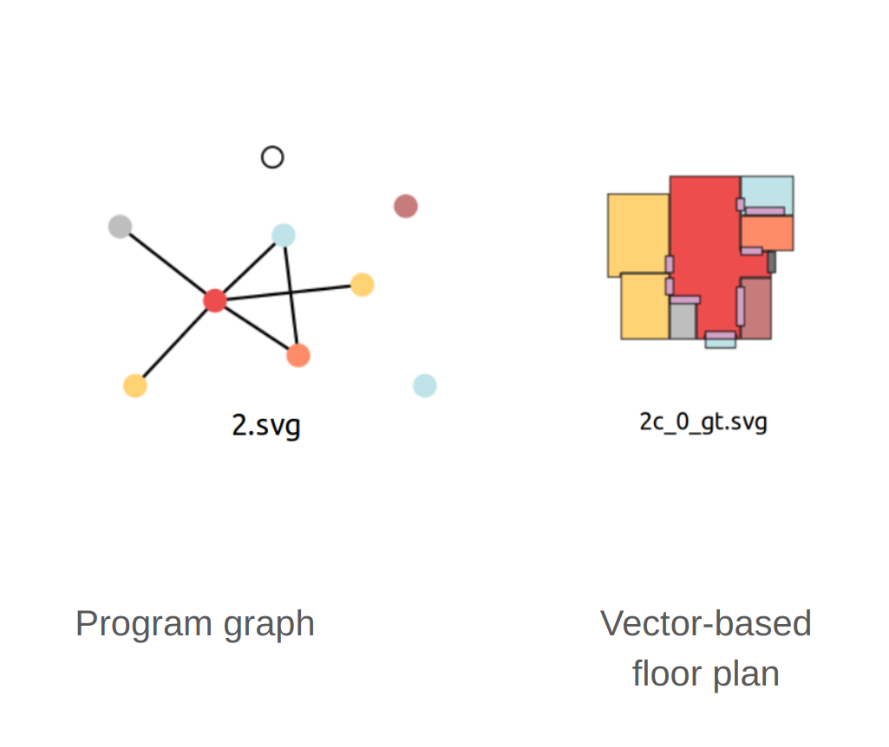
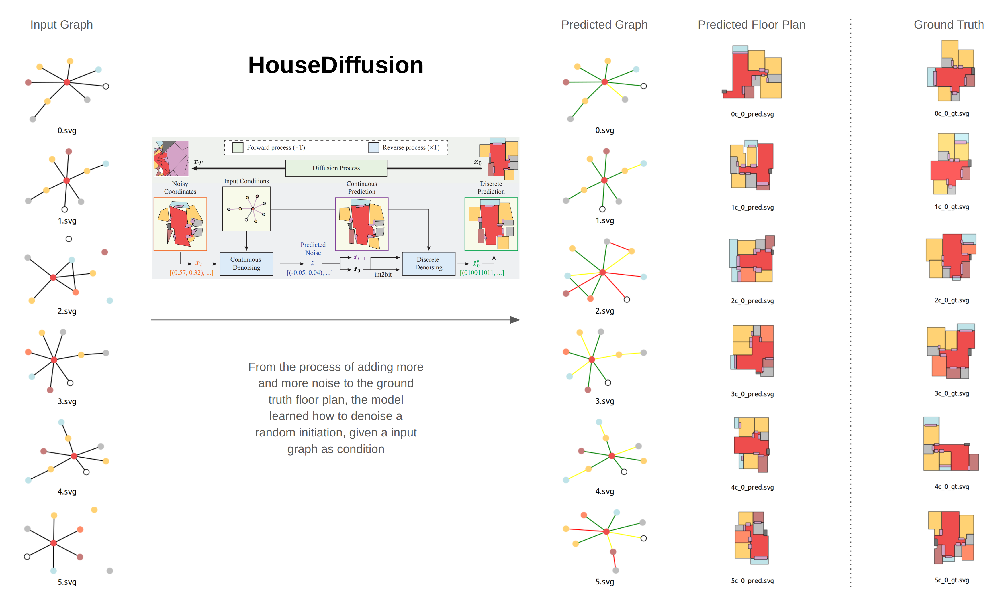

# HouseDiffusion
This is my reproduction of HouseDiffusion. The following instructions have been modified for my implementation.
My system specs: AMD® Ryzen 9 7900x & NVIDIA GeForce RTX 3090 Ti & Ubuntu 22.04.3 LTS.

**[HouseDiffusion: Vector Floorplan Generation via a Diffusion Model with Discrete and Continuous Denoising](https://arxiv.org/abs/2211.13287)**


## Installation
**1. Clone our repo and install the requirements:**

Our implementation is based on the public implementation of [guided-diffusion](https://github.com/openai/guided-diffusion). For installation instructions, please refer to their repository. Keep in mind that our current version has not been cleaned and some features from the original repository may not function correctly.

```
git clone https://github.com/aminshabani/house_diffusion.git
cd house_diffusion
pip install -r requirements.txt
pip install -e .
```
**2. Download the dataset and create the datasets directory**

- You can download the datasets from [RPLAN's website](http://staff.ustc.edu.cn/~fuxm/projects/DeepLayout/index.html) or by filling [this](https://docs.google.com/forms/d/e/1FAIpQLSfwteilXzURRKDI5QopWCyOGkeb_CFFbRwtQ0SOPhEg0KGSfw/viewform) form.
- We also use data preprocessing from House-GAN++ which you can find in [this](https://github.com/sepidsh/Housegan-data-reader) link.
Put all of the processed files from the downloaded dataset in a `datasets` folder in the current directory:

```
house_diffusion
├── datasets
│   ├── rplan
|   |   └── 0.json
|   |   └── 1.json
|   |   └── ...
|   └── ...
└── guided_diffusion
└── scripts
└── ...
```
This is a time-consuming step. Mine took about 3 days to process the entire Rplan dataset (80k 256x256 .png files) and got 76k processed .json files. For future steps, reviewing and editing the generated graph will be desired to correct missing edges, as shown below.  

  

After creating .json files, open `scripts/generate_list.py`, modify path to your rplan folder that contains all the .json files. And then run the file. This will generate a list.txt required for dataloader.

- We have provided a temporary model that you can download from [Google Drive](https://drive.google.com/file/d/16zKmtxwY5lF6JE-CJGkRf3-OFoD1TrdR/view?usp=share_link). 

## Running the code
Firstly, make sure your current directory is the scripts folder.
```
pwd
cd scripts
```

**1. Training**

You can run a single experiment using the following command:
```
python image_train.py --dataset rplan --batch_size 32 --set_name train --target_set 8
```
The argument `target_set` value refers to the number of rooms in the floor plan you are training for.
To load and resume training from a saved checkpoint, add an argument `--resume_checkpoint "<checkpoint path>"`

**2. Sampling**
To sample floorplans, you can run the following command inside the `scripts` directory. To provide different visualizations, please see the `save_samples` function from `scripts/image_sample.py`

```
python image_sample.py --dataset rplan --batch_size 32 --set_name eval --target_set 8 --model_path ckpts/exp/model250000.pt --num_samples 64
```
You can also run the corresponding code from `scripts/script.sh`. 
If you have never trained a model and do not have .npz files corresponding to your target_set value in `scripts/process_rplan`, simply running the above sampling script will result in an error. Run the training script until the training starts. Ignore the error message. You can then exit and re-run the sampling script.

**3. Reproduction results**
I trained for 1.12M steps, which took 20 hours using a NVIDIA GeForce RTX 3090 Ti. Loading checkpoint model1120000.pt and sampling on target_set 8, here is a sample of the results:

Unfortunately, I couldn't compute the FID value due to an error. Predictions of this sample showed that the many generated floor plans have empty spaces between rooms, and some rooms might have unreasonable corners. Note that this model only uses the program graph as input, not the building boundary. Therefore, the predictions usually have different boundaries from the ground truth.

## Citation

```
@article{shabani2022housediffusion,
  title={HouseDiffusion: Vector Floorplan Generation via a Diffusion Model with Discrete and Continuous Denoising},
  author={Shabani, Mohammad Amin and Hosseini, Sepidehsadat and Furukawa, Yasutaka},
  journal={arXiv preprint arXiv:2211.13287},
  year={2022}
}
```
